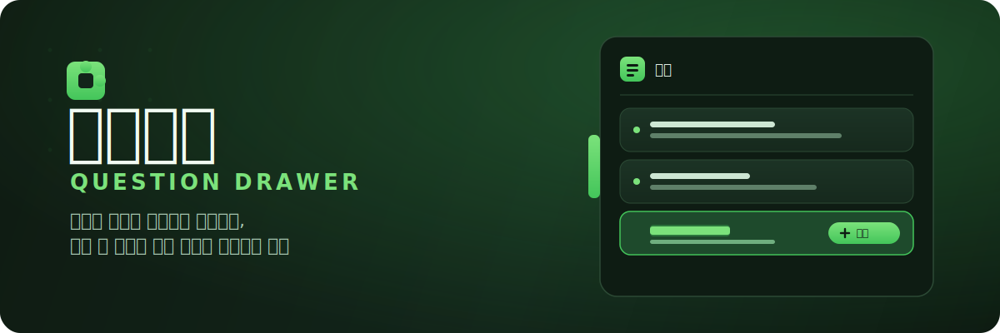

# 질문서랍 (Question Drawer)

  
 

 
 

## 시작하게 된 이유

Claude / ChatGPT / Gemini / Grok / Kimi / DeepSeek 답변을 읽다 보면 "이건 나중에 따로 물어봐야지" 싶은 단어들이 계속 쌓입니다. 하지만 새로 질문을 하다 보면, 정작 물어보려던 것들을 까먹기 쉽습니다.

**질문서랍**은 그런 질문을 놓치지 않으려고 만들었습니다. 궁금한 부분을 **드래그해 사이드 서랍에 담아두면**, 나중에 클릭 한 번으로 `"~에 대해 자세히 설명해줘"` 형태의 후속 질문을 대화 입력창에 넣어줍니다.

읽던 흐름을 끊지 않으면서 궁금증을 하나도 흘리지 않는 것, 질문서랍이 만들고 싶은 경험입니다.

## 주요 기능

### 서랍에 담기

- 드래그해서 텍스트를 선택하면 나타나는 _서랍에 담기_ 버튼으로 질문을 저장

### 서랍에서 꺼내기

- 담아둔 항목을 클릭하면 대화 입력창에 질문을 채워 넣음

### 대화별 분리

- URL의 대화 ID(`claude.ai/chat/<id>`, `chatgpt.com/c/<id>`, `gemini.google.com/app/<id>`, `grok.com/c/<id>`, `kimi.com/chat/<id>`, `chat.deepseek.com/a/chat/s/<id>`)를 기준으로 질문을 저장

 

> 모든 데이터는 브라우저 로컬 스토리지에만 저장되며 외부로 전송되지 않습니다.

## 지원 사이트

| 사이트   | 도메인               |
| -------- | -------------------- |
| Claude   | `claude.ai`          |
| ChatGPT  | `chatgpt.com`        |
| Gemini   | `gemini.google.com`  |
| Grok     | `grok.com`           |
| Kimi     | `kimi.com`           |
| DeepSeek | `chat.deepseek.com`  |

## 시작하기

<a href="https://chromewebstore.google.com/detail/question-drawer/mipekafnkjahilpfjkfhmmjjbhkofnlj">🔗크롬 확장 프로그램</a>
